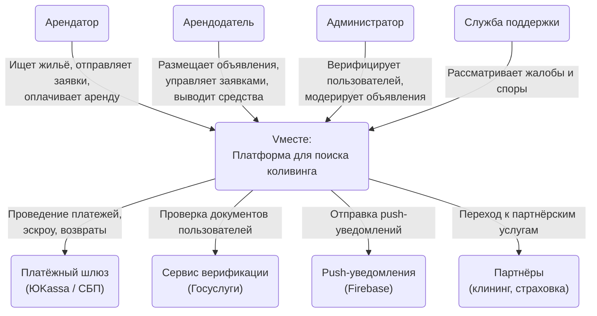
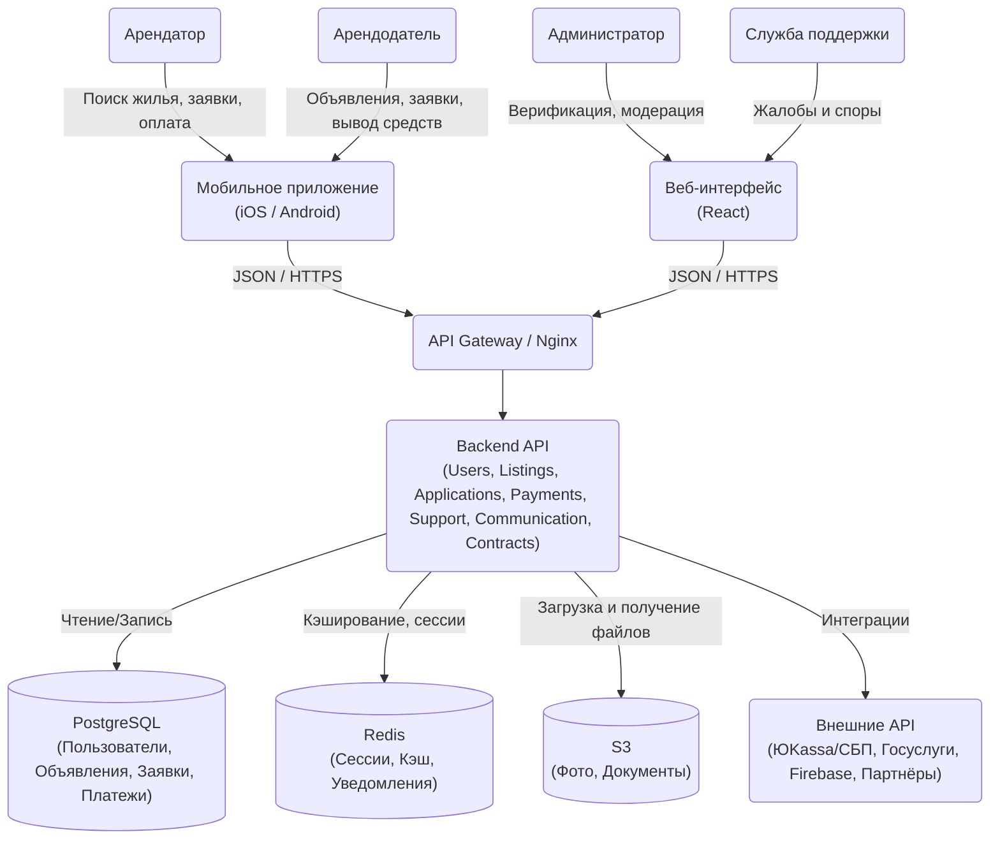

# Vместе — сервис для поиска коливинга
> *"Живи вместе, плати меньше!"*

---

## Задание 1

### Elevator Pitch

**Проблема:**
Аренда жилья в России дорогая, а поиск надёжного соседа или коливинга — долгий и непрозрачный процесс через посредников и разрозненные объявления.

**Решение:**
Vместе — оператор коливинга с мобильным приложением: арендатор сам ищет жильё и соседей, арендодатель сам размещает объект, а мы берём ответственность перед всеми сторонами сделки.

**Киллер-фича:**
В отличие от Авито и Циан, мы фокусируемся именно на совместном проживании: фильтры по образу жизни, верификация пользователей и встроенный чат для знакомства до заезда.

**Профит:**
Арендатор платит меньше и находит подходящих соседей, а арендодатель быстрее заполняет жильё без агентств и скрытых комиссий.

**CTA:**
Ищем первых арендодателей Москвы и Санкт-Петербурга для пилотного запуска.

---

### Lean Canvas

**1. Сегменты потребителей**

Арендаторы — люди, которые не могут позволить себе арендовать недвижимость целиком:
- Люди, которые приехали учиться (Студенты)
- Люди, которые учатся или отучились и только начали работать (Студенты или Выпускники)
- Люди, которые хотят переехать в данный город

Арендодатели — люди, у которых есть лишняя комната или недвижимость.

Ранние последователи:
- Студенты московских и питерских университетов
- Арендодатели, уже имеющие объявление на Авито/Циан/...

**2. Проблема**

Для Арендаторов:
- Нет денег на аренду целого объекта недвижимости
- Сложно найти соседа, причём подходящего

Для Арендодателей:
- Сложно быстро найти арендатора, причём надёжного

Существующие альтернативы:
- Авито/Циан — не заточены под коливинг
- Поиск через соцсети или знакомых — децентрализован и ненадёжен
- Colife — нет приложения и самообслуживания: только заявка через сайт с ручным подбором менеджером
- Международные сервисы (Airbnb, Spotahome) — не работают в России

**3. Уникальная ценность**

Vместе — это сервис аренды и управляющая компания, специализирующаяся на коливингах. Мы берём на себя ответственность перед всеми участниками сделки. При этом арендатор сам управляет процессом: ищет жильё, выбирает соседей и оформляет аренду — без лишних звонков и менеджеров.

Ключевые тезисы:
- Заточен именно под коливинг
- Единая точка сбора объявлений о коливинге
- Ответственность перед всеми участниками сделки
- Приложение вместо ручного подбора через менеджера
- Арендатор сам ищет жильё и выбирает соседей
- Арендодатель сам размещает объект и управляет заявками
- Подбор соседей по совместимости (образ жизни, привычки)

**4. Решение**

- *Нет денег на аренду целого объекта* → Возможность арендовать только часть недвижимости
- *Сложно найти подходящего соседа* → Фильтры по образу жизни (режим дня, привычки, наличие животных), Просмотр профилей потенциальных соседей, Встроенный чат для общения до заезда
- *Сложно быстро найти надёжного арендатора* → Возможность сдать часть недвижимости и получать хотя бы какой-то доход, Система рейтинга арендаторов, Верификация документов (паспорт и др.) силами оператора

**5. Каналы**

Для Арендаторов:
- Сотрудничество с университетами и их подразделениями
- Таргетированная реклама в социальных сетях
- SEO и контент-маркетинг (гайды по переезду, жизнь в коливинге)
- Реферальная программа: приведи соседа — получи бонус

Для Арендодателей:
- Таргетированная реклама в социальных сетях
- Переманивание с Авито/Циан (объявления о преимуществах платформы)

**6. Потоки прибыли**

- Комиссия с каждой успешной сделки аренды (% от суммы)
- Платное продвижение объявлений Арендодателей
- Премиум-подписка для Арендаторов (расширенные фильтры, больше откликов в день)
- Реферальная комиссия от партнёров (страхование жилья, клининг и др.)

**7. Структура издержек**

- Разработка и поддержка мобильного приложения (iOS + Android)
- Маркетинг и привлечение первых пользователей
- Верификация документов пользователей
- Облачная инфраструктура и серверы
- Юридическое сопровождение (договоры аренды, ответственность оператора)
- Служба поддержки пользователей

**8. Ключевые метрики**

- Количество активных объявлений на платформе
- Количество успешных сделок в месяц
- Конверсия: просмотр объявления → отклик → сделка
- Время от регистрации до первой сделки
- Retention: доля пользователей, вернувшихся за следующей арендой
- NPS (Net Promoter Score — индекс готовности рекомендовать сервис) арендаторов и арендодателей

**9. Скрытое преимущество**

- Накопленная база профилей совместимости — чем больше пользователей, тем точнее подбор соседей
- Сетевой эффект: больше арендодателей → больше арендаторов → больше сделок
- Репутационная система — история сделок и отзывов, которую сложно скопировать конкурентам
- Vместе как оператор — сам является проверенным и ответственным партнёром для обеих сторон сделки

---

## Задание 2

### Роли

- **Арендатор** — пользователь, который ищет комнату или место в коливинге
- **Арендодатель** — пользователь, который сдаёт часть или всю недвижимость
- **Администратор (Vместе)** — верифицирует документы пользователей и модерирует объявления
- **Служба поддержки (Vместе)** — разрешает споры и помогает пользователям в спорных ситуациях

### Роли и User Stories

| # | Роль | User Story | MoSCoW |
|---|------|------------|--------|
| 1 | Арендатор | Как арендатор, я хочу зарегистрироваться и создать профиль, чтобы получить доступ к объявлениям | Must |
| 2 | Арендатор | Как арендатор, я хочу заполнить анкету совместимости (режим дня, привычки), чтобы находить подходящих соседей | Should |
| 3 | Арендатор | Как арендатор, я хочу искать объявления с фильтрами (цена, район, условия), чтобы быстро найти подходящий вариант | Must |
| 4 | Арендатор | Как арендатор, я хочу просматривать объявление с фото и описанием, чтобы оценить жильё до визита | Must |
| 5 | Арендатор | Как арендатор, я хочу видеть профили потенциальных соседей, чтобы понять, комфортно ли нам жить вместе | Should |
| 6 | Арендатор | Как арендатор, я хочу отправить заявку на аренду, чтобы выразить интерес к объекту | Must |
| 7 | Арендатор | Как арендатор, я хочу отменить заявку на аренду, чтобы не создавать лишних обязательств | Must |
| 8 | Арендатор | Как арендатор, я хочу общаться с арендодателем через чат, чтобы уточнить детали до заезда | Should |
| 9 | Арендатор | Как арендатор, я хочу скачать договор аренды из приложения, чтобы иметь юридическое подтверждение сделки | Should |
| 10 | Арендатор | Как арендатор, я хочу оплатить аренду через приложение, чтобы не передавать деньги наличными | Must |
| 11 | Арендатор | Как арендатор, я хочу получить возврат средств при отмене сделки, чтобы не потерять деньги | Must |
| 12 | Арендатор | Как арендатор, я хочу оставить отзыв об арендодателе, чтобы помочь другим пользователям | Could |
| 13 | Арендатор | Как арендатор, я хочу обратиться в службу поддержки, чтобы решить спорную ситуацию | Must |
| 14 | Арендодатель | Как арендодатель, я хочу зарегистрироваться и пройти верификацию документов, чтобы вызывать доверие у арендаторов | Must |
| 15 | Арендодатель | Как арендодатель, я хочу создать объявление с фото, ценой и условиями, чтобы привлечь арендаторов | Must |
| 16 | Арендодатель | Как арендодатель, я хочу редактировать и снимать объявление, чтобы управлять актуальностью своих объектов | Must |
| 17 | Арендодатель | Как арендодатель, я хочу видеть входящие заявки, чтобы выбрать подходящего жильца | Must |
| 18 | Арендодатель | Как арендодатель, я хочу просматривать профили и рейтинги арендаторов, чтобы оценить их надёжность | Should |
| 19 | Арендодатель | Как арендодатель, я хочу принять или отклонить заявку, чтобы управлять своими объектами | Must |
| 20 | Арендодатель | Как арендодатель, я хочу общаться с арендатором через чат, чтобы уточнить детали до заезда | Should |
| 21 | Арендодатель | Как арендодатель, я хочу скачать договор аренды из приложения, чтобы иметь юридическое подтверждение сделки | Should |
| 22 | Арендодатель | Как арендодатель, я хочу получать арендную плату через приложение, чтобы иметь прозрачную историю платежей | Must |
| 23 | Арендодатель | Как арендодатель, я хочу выводить заработанные средства на банковский счёт, чтобы получать реальные деньги | Must |
| 24 | Арендодатель | Как арендодатель, я хочу оставить отзыв об арендаторе, чтобы предупредить других арендодателей | Could |
| 25 | Арендодатель | Как арендодатель, я хочу обратиться в службу поддержки, чтобы решить спорную ситуацию с арендатором | Must |
| 26 | Администратор | Как администратор, я хочу верифицировать документы пользователей, чтобы обеспечить безопасность сделок | Must |
| 27 | Администратор | Как администратор, я хочу модерировать объявления после публикации, чтобы не допускать мошенничества | Should |
| 28 | Служба поддержки | Как сотрудник поддержки, я хочу рассматривать жалобы и споры, чтобы защитить интересы обеих сторон | Must |

### MVP — скелет (Must)

| # | Роль | User Story |
|---|------|------------|
| 1 | Арендатор | Регистрация и создание профиля |
| 3 | Арендатор | Поиск объявлений с фильтрами |
| 4 | Арендатор | Просмотр объявления с фото и описанием |
| 6 | Арендатор | Отправка заявки на аренду |
| 7 | Арендатор | Отмена заявки на аренду |
| 10 | Арендатор | Оплата аренды через приложение |
| 11 | Арендатор | Возврат средств при отмене сделки |
| 13 | Арендатор | Обращение в службу поддержки |
| 14 | Арендодатель | Регистрация и верификация документов |
| 15 | Арендодатель | Создание объявления |
| 16 | Арендодатель | Редактирование и снятие объявления |
| 17 | Арендодатель | Просмотр входящих заявок |
| 19 | Арендодатель | Принятие или отклонение заявки |
| 22 | Арендодатель | Получение арендной платы через приложение |
| 23 | Арендодатель | Вывод средств на банковский счёт |
| 25 | Арендодатель | Обращение в службу поддержки |
| 26 | Администратор | Верификация документов пользователей |
| 28 | Служба поддержки | Рассмотрение жалоб и споров |

### MLP — вау-эффект (Should)

| # | Роль | User Story |
|---|------|------------|
| 2 | Арендатор | Анкета совместимости |
| 5 | Арендатор | Просмотр профилей потенциальных соседей |
| 8 | Арендатор | Чат с арендодателем |
| 9 | Арендатор | Скачать договор аренды из приложения |
| 18 | Арендодатель | Просмотр профилей и рейтингов арендаторов |
| 20 | Арендодатель | Чат с арендатором |
| 21 | Арендодатель | Скачать договор аренды из приложения |
| 27 | Администратор | Постмодерация объявлений |

### Остальное (Could)

| # | Роль | User Story |
|---|------|------------|
| 12 | Арендатор | Отзыв об арендодателе |
| 24 | Арендодатель | Отзыв об арендаторе |

### Детализация требований

**История #6 — Отправка заявки на аренду**

ФТ:
- Система позволяет авторизованному арендатору отправить заявку на объявление
- Система проверяет, что у арендатора нет активной заявки на тот же объект
- Система проверяет, что объявление не снято и не занято
- Арендатор указывает желаемую дату заезда и срок аренды при отправке заявки
- Арендатор может добавить сопроводительное сообщение к заявке
- Система допускает несколько активных заявок на разные объявления одновременно
- Система меняет статус заявки на "На рассмотрении"
- Система уведомляет арендодателя о новой заявке (push + in-app уведомление)
- Система уведомляет арендатора об изменении статуса заявки (принята/отклонена)
- Система отображает арендатору список всех его заявок с текущими статусами

НФТ:
- Заявка доставляется арендодателю за ≤ 5 секунд
- Система обрабатывает ≥ 100 одновременных заявок без деградации
- Доступность функции ≥ 99.5%
- Персональные данные арендатора передаются только арендодателю, третьим лицам не раскрываются
- История заявок хранится не менее 1 года
- Интерфейс отправки заявки корректно работает на iOS и Android

---

**История #10 — Оплата аренды через приложение**

ФТ:
- Система позволяет арендатору оплатить аренду картой или через СБП
- Система замораживает сумму до подтверждения заезда (эскроу)
- Система переводит средства арендодателю после подтверждения заезда
- Система автоматически удерживает комиссию платформы при переводе
- Система поддерживает оплату только в рублях
- При неудачной оплате система уведомляет арендатора с указанием причины
- Система блокирует повторную оплату за уже оплаченный период
- Система автоматически напоминает арендатору об оплате за 3 дня до срока
- Система отправляет квитанцию об оплате арендатору и арендодателю
- Система ведёт историю всех транзакций для обеих сторон
- В случае технического сбоя во время оплаты средства не списываются

НФТ:
- Время проведения платежа ≤ 10 секунд
- Платёжный шлюз соответствует стандарту PCI DSS
- Все транзакции шифруются по протоколу TLS 1.2+
- Доступность платёжного модуля ≥ 99.9%
- Система выдерживает ≥ 50 одновременных платежей
- История транзакций хранится не менее 3 лет (требования законодательства РФ)
- Автоматический возврат средств выполняется в течение 3–5 рабочих дней

---

## Задание 3

### DDD

**1. Домен: Пользователи (User Management)**
Отвечает за всё, что связано с учётными записями и личностью пользователя.

Основные сущности (Глоссарий):
- User — учётная запись пользователя
- Profile — публичный профиль (имя, фото, описание)
- Role — роль пользователя (арендатор, арендодатель)
- Verification — статус верификации документов
- CompatibilityProfile — анкета совместимости (режим дня, привычки, наличие животных)
- Rating — числовой рейтинг пользователя на основе отзывов
- Review — отзыв одного пользователя о другом

---

**2. Домен: Объявления (Listing Management)**
Отвечает за создание, публикацию и поиск объявлений о жилье.

Основные сущности (Глоссарий):
- Listing — объявление об аренде
- ListingStatus — статус объявления (активно, снято, занято)
- Attachment — вложение к объявлению (фото, видео, документы)
- Filter — параметры поиска (цена, район, условия)
- Location — адрес и район объекта недвижимости

---

**3. Домен: Заявки (Application Management)**
Отвечает за процесс подачи, рассмотрения и отмены заявок на аренду.

Основные сущности (Глоссарий):
- Application — заявка арендатора на объявление
- ApplicationStatus — статус заявки (на рассмотрении, принята, отклонена, отменена)
- CoverLetter — сопроводительное сообщение арендатора к заявке

---

**4. Домен: Платежи (Payment Management)**
Отвечает за весь денежный цикл: оплата, заморозка, перевод, возврат, вывод.

Основные сущности (Глоссарий):
- Payment — платёж за аренду
- Escrow — замороженные средства до подтверждения заезда
- Refund — возврат средств
- Commission — комиссия платформы
- Withdrawal — вывод средств арендодателем

---

**5. Домен: Поддержка (Support Management)**
Отвечает за обработку жалоб, споров и помощи пользователям.

Основные сущности (Глоссарий):
- Ticket — обращение пользователя в поддержку
- TicketStatus — статус обращения (открыто, в работе, закрыто)
- Dispute — спор между арендатором и арендодателем
- DisputeStatus — статус спора (открыт, на рассмотрении, решён)
- Attachment — прикреплённый файл к тикету или спору (фото, документы, скриншоты)

---

**6. Домен: Коммуникации (Communication Management)**
Отвечает за общение между сторонами сделки и уведомления о событиях.

Основные сущности (Глоссарий):
- Chat — чат между арендатором и арендодателем
- Message — сообщение в чате
- Notification — push/in-app уведомление о событиях

---

**7. Домен: Договоры (Contract Management)**
Отвечает за оформление, хранение и расторжение договоров аренды.

Основные сущности (Глоссарий):
- Contract — договор аренды между сторонами
- ContractStatus — статус договора (на подписании, активен, расторгнут)
- Signature — электронная цифровая подпись, автоматически проставляемая системой при формировании договора
- Attachment — прикреплённые документы к договору

---

### BDD

**Критический путь MVP:** Арендатор находит объявление → отправляет заявку → арендодатель принимает → арендатор оплачивает

---

**Сценарий успеха**

*Дано:*
- Арендатор авторизован в системе и верифицирован
- Объявление активно и не занято
- Арендодатель верифицирован и принимает заявки
- У арендатора привязана карта или доступен СБП
- Заявка арендатора принята арендодателем

*Когда:*
- Арендатор переходит к оплате и подтверждает транзакцию
- Платёжный шлюз **успешно** проводит платёж

*Тогда:*
- Средства замораживаются на эскроу-счёте платформы
- Объявление получает статус "Занято"
- Арендатор получает квитанцию об оплате
- Арендодатель получает уведомление об успешной оплате
- Система автоматически формирует и отправляет подписанный договор обеим сторонам

---

**Сценарий отказа**

*Дано:*
- Арендатор авторизован в системе и верифицирован
- Объявление активно и не занято
- Арендодатель верифицирован и принимает заявки
- У арендатора привязана карта или доступен СБП
- Заявка арендатора принята арендодателем

*Когда:*
- Арендатор переходит к оплате и подтверждает транзакцию
- Платёжный шлюз **отклоняет** платёж (недостаточно средств / карта заблокирована)

*Тогда:*
- Средства не списываются
- Статус заявки остаётся "Принята"
- Объявление остаётся активным
- Арендатор получает уведомление с причиной отказа и предложением повторить попытку
- Арендодатель получает уведомление о задержке оплаты

### Wireframes

**Экран 1 — Поиск объявлений**
```
┌─────────────────────────┐
│  🔍 Поиск по городу     │
├─────────────────────────┤
│ [Цена ▼] [Район ▼] [Ещё]│
├─────────────────────────┤
│ ┌─────────────────────┐ │
│ │ [фото]              │ │
│ │ Комната, Москва     │ │
│ │ 15 000 ₽/мес        │ │
│ │ ★ 4.8 · 2 соседа    │ │
│ └─────────────────────┘ │
│ ┌─────────────────────┐ │
│ │ [фото]              │ │
│ │ Комната, Москва     │ │
│ │ 18 000 ₽/мес        │ │
│ │ ★ 4.5 · 3 соседа    │ │
│ └─────────────────────┘ │
└─────────────────────────┘
```

**Экран 2 — Карточка объявления**
```
┌─────────────────────────┐
│ ← Назад                 │
├─────────────────────────┤
│ [    фото объекта    ]  │
├─────────────────────────┤
│ Комната на Арбате       │
│ 15 000 ₽/мес · Москва   │
│                         │
│ О жилье:                │
│ [описание объекта...]   │
│                         │
│ Соседи:                 │
│ [фото] Иван, 24         │
│ [фото] Мария, 22        │
├─────────────────────────┤
│ [  Отправить заявку  ]  │
└─────────────────────────┘
```

**Экран 3 — Форма заявки**
```
┌─────────────────────────┐
│ ← Заявка на аренду      │
├─────────────────────────┤
│ Дата заезда:            │
│ [   01.06.2026       ▼] │
│                         │
│ Срок аренды:            │
│ [   6 месяцев        ▼] │
│                         │
│                         │
│ Комментарий:            │
│ ┌─────────────────────┐ │
│ │ Привет! Я студент...│ │
│ │                     │ │
│ └─────────────────────┘ │
├─────────────────────────┤
│ [      Отправить     ]  │
└─────────────────────────┘
```

**Экран 4 — Оплата**
```
┌─────────────────────────┐
│ ← Оплата аренды         │
├─────────────────────────┤
│ Комната на Арбате       │
│ Заезд: 01.06.2026       │
│ Срок: 6 месяцев         │
├─────────────────────────┤
│ Сумма: 15 000 ₽         │
│ Комиссия: 750 ₽         │
│ Итого: 15 750 ₽         │
├─────────────────────────┤
│ Способ оплаты:          │
│ ◉ Банковская карта      │
│ ○ СБП                   │
│ [•••• •••• •••• 4242]   │
├─────────────────────────┤
│ [       Оплатить     ]  │
└─────────────────────────┘
```

---

### API-First

**1. POST /api/v1/applications — Отправка заявки**

```json
// Request
{
  "listing_id": 123,             // ID объявления, на которое подаётся заявка
  "move_in_date": "2026-06-01",  // Желаемая дата заезда
  "duration_months": 6,          // Желаемый срок аренды в месяцах
  "comment": "Привет!..."        // Комментарий арендатора (необязательно)
}

// Response 201 — Заявка создана
{
  "application_id": 456,         // Уникальный ID созданной заявки
  "status": "pending",           // Статус заявки: pending (на рассмотрении)
  "listing_id": 123,             // ID объявления
  "tenant_id": 789,              // ID арендатора, подавшего заявку
  "move_in_date": "2026-06-01",  // Подтверждённая дата заезда
  "duration_months": 6,          // Подтверждённый срок аренды в месяцах
  "created_at": "2026-05-06T10:00:00Z" // Время создания заявки
}

// Response 409 — Заявка уже существует
{
  "error": "DUPLICATE_APPLICATION",           // Код ошибки
  "message": "Вы уже подали заявку на это объявление" // Описание для пользователя
}

// Response 400 — Объявление недоступно
{
  "error": "LISTING_UNAVAILABLE",             // Код ошибки
  "message": "Объявление снято или уже занято" // Описание для пользователя
}
```

---

**2. POST /api/v1/payments — Оплата аренды**

```json
// Request
{
  "application_id": 456,        // ID принятой заявки, по которой производится оплата
  "payment_method": "card",     // Способ оплаты: card (карта) или sbp (СБП)
  "card_token": "tok_abc123"    // Токен карты от платёжного шлюза (не сами данные карты)
}

// Response 201 — Платёж проведён, деньги в эскроу
{
  "payment_id": 789,            // Уникальный ID платежа
  "status": "escrow",           // Статус: escrow — средства заморожены до подтверждения заезда
  "application_id": 456,        // ID заявки, по которой прошёл платёж
  "amount": 15000,              // Сумма аренды в рублях без комиссии
  "commission": 750,            // Комиссия платформы (5% от суммы)
  "total": 15750,               // Итоговая сумма списания с арендатора
  "currency": "RUB",            // Валюта платежа (только рубли)
  "payment_method": "card",     // Использованный способ оплаты
  "created_at": "2026-05-06T10:05:00Z", // Время проведения платежа
  "receipt_url": "/receipts/789"        // Ссылка на квитанцию об оплате
}

// Response 402 — Платёж отклонён
{
  "error": "PAYMENT_DECLINED",          // Код ошибки
  "message": "Платёж отклонён банком",  // Описание для пользователя
  "reason": "INSUFFICIENT_FUNDS"        // Причина отказа от платёжного шлюза
}
```

---

## Задание 4

### Схема C4 (Уровни 1 и 2)

Архитектура: модульный монолит (чёткое разделение доменов: Объявления, Заявки, Платежи, Договоры). Мобильное приложение является основной точкой входа для Арендаторов и Арендодателей, веб-интерфейс — для Администраторов и Службы поддержки.

### Уровень 1: Системный контекст (System Context)

Описывает взаимодействие пользователей с системой Vместе и внешними сервисами.



---

### Уровень 2: Контейнеры (Containers)

Раскрывает внутреннее устройство платформы Vместе.



---

### Технологический стек MVP

| Компонент | Технология | Обоснование |
|:---|:---|:---|
| **Backend** | Python / Django REST | Высокая скорость разработки, встроенная админка, надёжная работа с реляционными БД — критично для эскроу и платёжных транзакций |
| **Mobile** | React Native | Одна команда создаёт приложение сразу для iOS и Android, быстрый выход на рынок |
| **Frontend** | React + Material UI | Быстрая сборка веб-интерфейса для администраторов и поддержки на готовых UI-компонентах |
| **Database** | PostgreSQL | ACID-транзакции критически важны для эскроу, платежей и целостности сделок |
| **Cache** | Redis | Хранение сессий, кэш данных, очередь уведомлений |
| **File Storage** | S3 | Надёжное хранение фото объектов и верификационных документов |
| **Контейнеризация** | Docker | Контейнеризация для быстрого развёртывания и масштабирования |
| **Прокси / балансировщик** | Nginx | Маршрутизация запросов, SSL-терминация, балансировка нагрузки |

---

## Задание 5

### Hiring Plan

| Роль | Кол-во | Зоны ответственности | Занятость |
|------|--------|---------------------|-----------|
| **Product Manager** | 1 | Формирование и приоритизация бэклога; коммуникация с командой и стейкхолдерами; приёмка готовых фич | Full-time |
| **Backend Developer** | 2 | Разработка REST API (Django); интеграция платёжного шлюза, верификации и Firebase | Full-time |
| **Mobile Developer** | 1 | Разработка приложения на React Native для iOS и Android | Full-time |
| **Frontend Developer** | 1 | Разработка веб-интерфейса для администраторов и поддержки (React + Material UI) | Full-time |
| **UX/UI Designer** | 1 | Проектирование интерфейса приложения; поддержка дизайн-системы | Full-time |
| **QA Engineer** | 1 | Тестирование критических пользовательских сценариев; баг-репорты | Full-time |
| **DevOps** | 1 | Настройка инфраструктуры (Docker, Nginx, S3); CI/CD и деплой | Part-time |

**Итого: 8 человек** (7 full-time + 1 part-time)

---

### Development Framework

Выбранная методология: **Scrum**

1. Продукт новый, требования будут меняться по мере получения обратной связи от первых пользователей — короткие спринты позволяют быстро адаптироваться
2. Двухнедельные спринты дают возможность регулярно проверять гипотезы и выпускать рабочие версии MVP
3. Чёткие роли и ритуалы обеспечивают прозрачность прогресса для всех участников команды

---

### Team Rituals

| Ритуал | Цель | Когда | Длительность |
|--------|------|-------|--------------|
| **Sprint Planning** | Планирование задач на спринт, оценка трудозатрат | Понедельник, начало спринта | 2 часа |
| **Daily Standup** | Ежедневная синхронизация: что сделал, что планирую, есть ли блокеры | Каждый день, утро | 15 минут |
| **Backlog Refinement** | Уточнение и декомпозиция задач для следующего спринта | Пятница середины спринта | 1 час |
| **Sprint Review** | Демонстрация результатов спринта, приёмка фич PM-ом | Пятница конца спринта | 1 час |
| **Retrospective** | Разбор процесса: что работало, что улучшить | Пятница конца спринта, после Review | 1 час |

---

## Задание 6

### Управление рисками

**Шкала вероятности:** 1 — Низкая, 2 — Средняя, 3 — Высокая  
**Шкала влияния:** 1 — Низкое, 2 — Среднее, 3 — Высокое  
**Итог** = Вероятность × Влияние  

| # | Риск | Тип (Подтип) | Вероятность | Влияние | Итог | Стратегия | Меры |
|---|------|--------------|:-----------:|:-------:|:----:|-----------|------|
| 1 | **Холодный старт** | Внешний (Рыночный) | 3 | 3 | 9 | Смягчить / Переделать план | Сначала привлекаем арендодателей; пилот в одном городе |
| 2 | **Низкое доверие к платформе** | Внешний (Рыночный) | 3 | 2 | 6 | Смягчить / Предотвратить | Верификация, эскроу, отзывы, прозрачность оператора |
| 3 | **Регуляторные риски эскроу** | Внешний (Регуляторный) | 2 | 3 | 6 | Смягчить / Переделать план | Юридическая консультация до запуска; номинальный счёт через банк-партнёр |
| 4 | **Баги в платёжном модуле** | Внутренний (Технический) | 2 | 3 | 6 | Смягчить / Переделать план | Тщательное тестирование; ограниченный пилот; быстрый фикс через Scrum |
| 5 | **Медленная верификация** | Внутренний (Организационный) | 3 | 2 | 6 | Смягчить / Предотвратить | Автоматизация через API Госуслуг; дополнительный верификатор на старте |
| 6 | **Выход крупного игрока** | Внешний (Рыночный) | 2 | 2 | 4 | Смягчить / Предотвратить | Фокус на нише; сетевой эффект как защита; быстрый рост базы |
| 7 | **Низкий спрос на подписку** | Внутренний (Управленческий) | 2 | 2 | 4 | Смягчить / Предотвратить | A/B тестирование; пересмотр фич; усиление комиссионной модели |
| 8 | **ЧП в объекте недвижимости** | Внешний (Чрезвычайный) | 2 | 3 | 6 | Смягчить / Переделать план | Страховые партнёры; регламент ЧП в договоре; экстренная линия поддержки |
| 9 | **Умышленная порча имущества** | Внешний (Чрезвычайный) | 2 | 3 | 6 | Смягчить / Переделать план | Страховые партнёры; страховой депозит при заселении; фото-фиксация состояния при заезде и выезде; верификация арендаторов |

---
